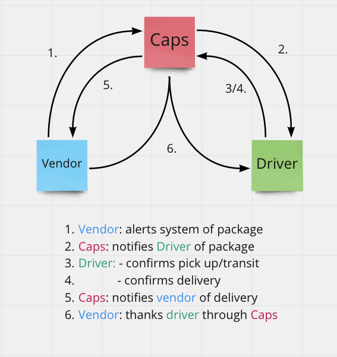

# Caps

## Author

**Steve - AlsoSteve - Ngo**

# Lab 11

* This is the first day of our CAPs thing, written in Node.js.

* In this part, the goal is to establish a system of events and handlers the point is to change and update the events system as we move along while the handlers stay pretty much as-is. “Delivering a package” won’t change the handler even when the event does.

### Whiteboard Process

#### User Stories n Stuff

*The following user/developer stories detail the major functionality for this part of the project.*

**As a vendor**, I want the system to alert when a package is going to be picked up. 

**As a driver**, I want a notification when a package is ready to be delivered. 

**As a driver**, I want to send a notification to the system when I have picked up a package and it's in transit. 

  * I want to send a notification to the system when I have delivered a package. 
  
**As a vendor**, I want a notification when my package is delivered. 

#### Developer Experience

*As a developer, the following are our stories that pertain to those above:*

**As a developer**, I want to use industry standards that will manage the status of each package. 

    * I want to create an event-driven-system that gives me the ability to write code directly in response to events happening in real time.

#### Credit and Collaboration

* This code was written alog side **Matt Miguel** and **Joey Hernandez**

# Lab 12

* Continue working on a multi-day build of our delivery tracking system, moving event management to socket.io.

* In **_Phase 2_**, we’ll be changing the underlying networking implementation of our CAPS system from using node events to using a library called socket.io so that we can do networked events. Socket.io manages the connection pool for us, makes broadcasting much easier to operate, and works well both on the terminal (between servers) and with web clients.

* The core functionality we’ve already built remains the same. The difference in this phase is that we’ll be creating a networking layer. As such, the user stories that speak to application functionality remain unchanged, but a new set theme emerges to get us through the refactoring.

### Whiteboard Process

#### User Stories n Stuff

*The following user/developer stories detail the major functionality for this part of the project.*

**As a vendor**, I want the system to alert when a package is going to be picked up. 

**As a driver**, I want a notification when a package is ready to be delivered. 

**As a driver**, I want to send a notification to the system when I have picked up a package and it's in transit. 

  * I want to send a notification to the system when I have delivered a package. 
  
**As a vendor**, I want a notification when my package is delivered. 

#### Developer Experience

*As a developer, the following are our stories that pertain to those above:*

**As a developer**, I want to use industry standards that will manage the status of each package. 

    * I want to create an event-driven-system that gives me the ability to write code directly in response to events happening in real time.
    
#### Credit and Collaboration
> “I want to thank me for believing in me, I want to thank me for doing all this hard work. I wanna thank me for having no days off. I wanna thank me for never quitting. I wanna thank me for always being a giver and trying to give more than I receive. I wanna thank me for trying to do more right than wrong. I wanna thank me for being me at all times." - Snoop Dogg

# Lab 13
* **_CAPS Phase 3_**: Complete work on a multi-day build of our delivery tracking system, adding queued delivery.

* In this phase, rather than just “fire” events and hope that our vendors and drivers respond to them, we’re going to implement a “queue” system so that nothing gets lost. Every event sent will be logged and held onto by the server until the intended recipient acknowledges that they received the message. At any time, a subscriber can get all of the messages they might have missed.

* In this final phase, we’ll be building out the queue itself, getting our vendors subscribed to it, and focusing on just one event - delivered to set the pattern for subscribing to, and working with queues.
### Whiteboard Process

#### User Stories n Stuff

*The following user/developer stories detail the major functionality for this part of the project.*

**As a vendor**, I want to “subscribe” to “delivered” notifications so that I know when my packages are delivered.

**As a vendor**, I want to “catch up” on any “delivered” notifications that I might have missed so that I can see a complete log.

**As a driver**, I want to “subscribe” to “pickup” notifications so that I know what packages to deliver.

**As a driver**, I want to “catch up” on any “pickup” notifications I may have missed so that I can deliver everything.

**As a driver**, I want a way to “scan” a delivery so that the vendors know when a package has been delivered.

#### Developer Experience

*As a developer, the following are our stories that pertain to those above:*

**As a developer**:

- I want to create a system of tracking who is subscribing to each event.

- I want to place all inbound messages into a “queue” so that my application knows what events are to be delivered.

- I want to create a system for communicating when events have been delivered and received by subscribers.

- I want to delete messages from the queue after they’ve been received by a subscriber, so that I don’t re-send them.

- I want to create a system for allowing subscribers to retrieve all undelivered messages in their queue.

    
#### Credit and Collaboration