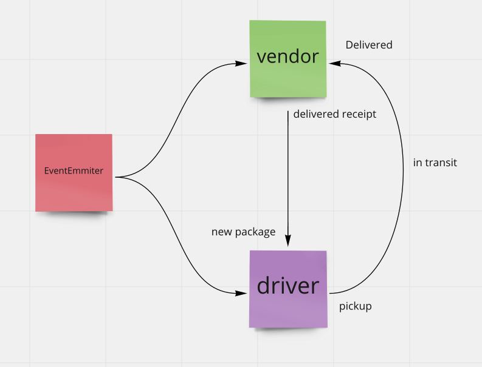

# Caps

## Author

**Steve - AlsoSteve - Ngo**

# Lab 11

* This is the first day of our CAPs thing, written in Node.js.

* In this part, the goal is to establish a system of events and handlers the point is to change and update the events system as we move along while the handlers stay pretty much as-is. “Delivering a package” won’t change the handler even when the event does.

### Whiteboard Process

#### User Stories n Stuff

*The following user/developer stories detail the major functionality for this part of the project.*

**As a vendor**, I want the system to alert when a package is going to be picked up. 

**As a driver**, I want a notification when a package is ready to be delivered. 

**As a driver**, I want to send a notification to the system when I have picked up a package and it's in transit. 

  * I want to send a notification to the system when I have delivered a package. 
  
**As a vendor**, I want a notification when my package is delivered. 

#### Developer Experience

*As a developer, the following are our stories that pertain to those above:*

**As a developer**, I want to use industry standards that will manage the status of each package. 

    * I want to create an event-driven-system that gives me the ability to write code directly in response to events happening in real time.

#### Credit and Collaboration

* This code was written alog side **Matt Miguel** and **Joey Hernandez**

# Lab 12

* Continue working on a multi-day build of our delivery tracking system, moving event management to socket.io.

* In Phase 2, we’ll be changing the underlying networking implementation of our CAPS system from using node events to using a library called socket.io so that we can do networked events. Socket.io manages the connection pool for us, makes broadcasting much easier to operate, and works well both on the terminal (between servers) and with web clients.

* The core functionality we’ve already built remains the same. The difference in this phase is that we’ll be creating a networking layer. As such, the user stories that speak to application functionality remain unchanged, but a new set theme emerges to get us through the refactoring.

### Whiteboard Process

#### User Stories n Stuff

*The following user/developer stories detail the major functionality for this part of the project.*

**As a vendor**, I want the system to alert when a package is going to be picked up. 

**As a driver**, I want a notification when a package is ready to be delivered. 

**As a driver**, I want to send a notification to the system when I have picked up a package and it's in transit. 

  * I want to send a notification to the system when I have delivered a package. 
  
**As a vendor**, I want a notification when my package is delivered. 

#### Developer Experience

*As a developer, the following are our stories that pertain to those above:*

**As a developer**, I want to use industry standards that will manage the status of each package. 

    * I want to create an event-driven-system that gives me the ability to write code directly in response to events happening in real time.
    
#### Credit and Collaboration
